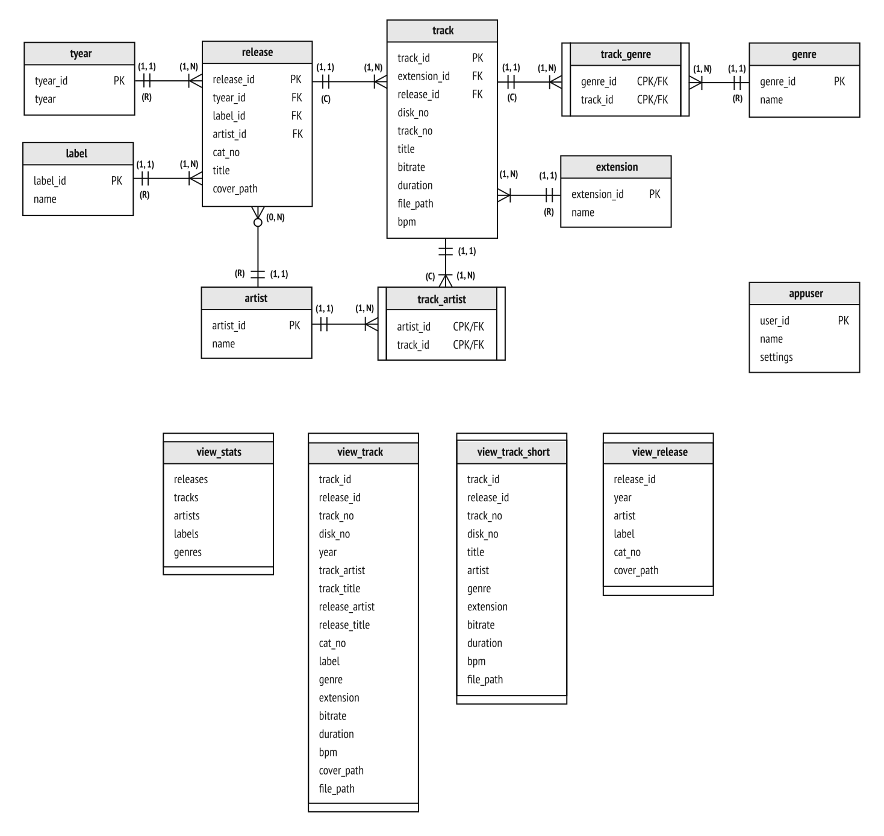

# About

**Musicbox is a browser-based music library explorer for a home server. It parses standard ID3v2 tags of your audio files and provides a simple interface to search, sort, and filter your music collection.**


## What problem does it solve

I have a pretty extensive music collection (around 5 thousand tracks), but navigating through it had always been very frustrating — as a Linux user, I couldn't find any good music manager satisfying my needs.


## Features

- two types of views: by tracks (list view) and by releases (grid view)
- searching, filtering, and sorting
- detailed library statistics
- audio player
- supported formats: mp3, flac


## Development Notes

- **Frontend:** React.js (TypeScript)
- **Backend:** Node.js (TypeScript), PostgreSQL, Nginx

It is primarily a database-centric app. Although designing the database schema was pretty simple, writing different types of queries to provide filtering/sorting/searching/pagination features was a real challenge, so the work with the database took the most time of development. Also, I haven't been using any ORM, just raw SQL via `node-postgres`.

The application runs in four Docker containers:

- `db-music` (the heart of the app)
- `api` (Node.js REST API providing all sorts of CRUD operations; the current version of frontend client uses only reading/filtering/sorting/searching capabilities of API, it doesn't modify any data in database)
- `client` (React.js client, regular SPA)
- `nginx` (as a reverse proxy; routes requests to `client` and `api` containers)


## App Architecture


## Database Schema



# API Doc

[Here](./doc/api.md)


# Getting Started

All configuration is through the env vars and `docker-compose.yml`.

Note that for the app to be actually helpful, make sure your music library is properly tagged (the app parses only standard ID3v2 tags)

1. Mount the directory where you store music as the volume of the `api` container (in `docker-compose.yml`)

  ```shell

    api:
      container_name: api
      ...
      volumes:
        # the path after `:` (i.e. `/music/`) should match the path in 
        # `MUSIC_LIB_DIR` variable in `./api/.dev.env`
        - /mnt/I9FWKI857RFW5WMC2/music_archive/:/music/
  ```

2. Start up Docker Compose.
   ```shell
   docker-compose up db-music
   docker-compose up api # on first run Node.js will start parsing all tracks adding them to database, it will take some time
   docker-compose up client
   docker-compose up nginx
   ```
