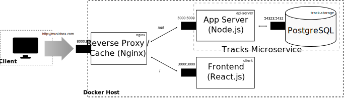

# About

Browser based music library explorer for home server

## Features

* view all file metadata
* audio player
* Supported formats
  * `mp3`
  * `flac`

# Development notes

* **Frontend:** React.js (TypeScript)
* **Backend:** Node.js (TypeScript), PostgreSQL, Nginx

Runs in Docker

## Application Architecture

